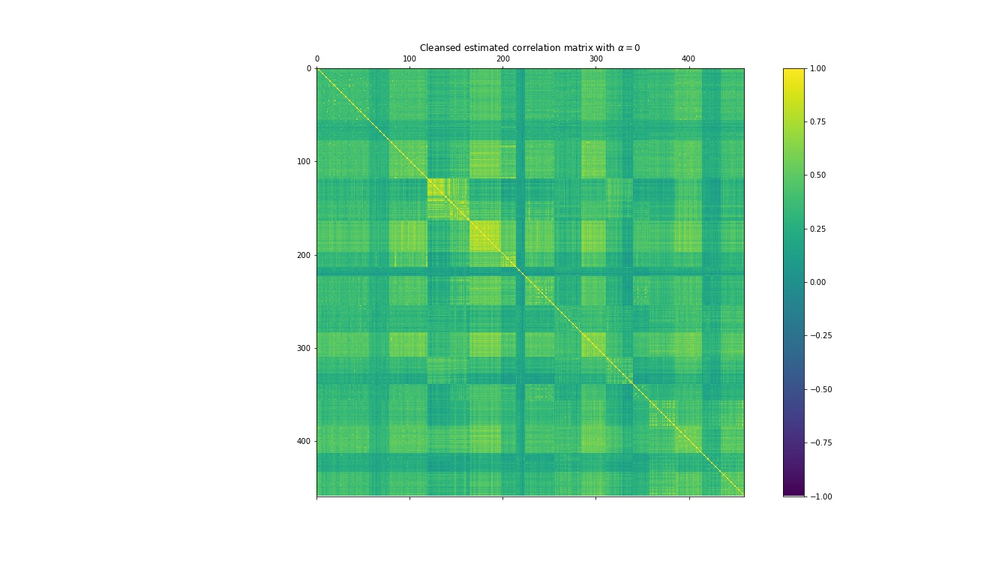
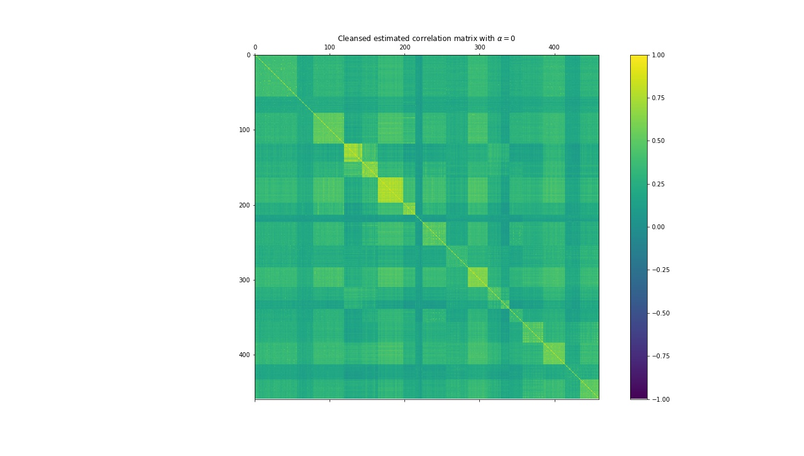
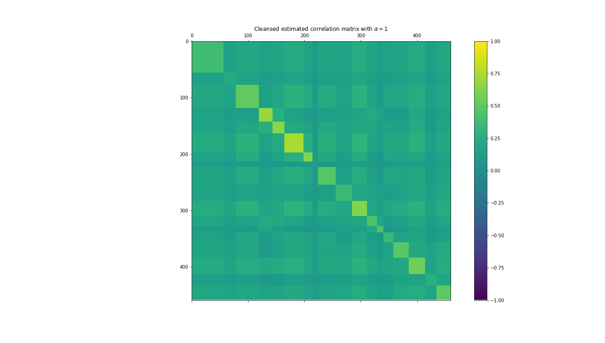

# Cluster based shrinkage of correlation matrix implementation

This is an implementation using Python of the Cluster-based shrinkage correlation estimator proposed by Begusic and Kostanjcar in the paper *Cluster-Based Shrinkage of Correlation Matrices for Portfolio Optimization* (2019) that can be found [here](https://ieeexplore.ieee.org/document/8868482).

This estimator uses a clustering method to identify the underlying structure in the sample correlation matrix and then uses the structure to regularize the entries of the sample correlation estimator. 

The purpose of this estimator is to regularize the correlation matrix estimation of a data set in high dimensionality (i.e. when the number of columns and the number of rows of your data set are big). There is a shrink factor $\alpha$ that allows adjusting the level of regularization of the estimator between the sample correlation estimator (R) (this is the one that is typically implemented in `np.corrcoef` or `pd.Dataframe.corr` ) and a shrinked version of R.

<p align = "center">

</p>


## Use
You can use this estimator on a pandas dataframe of size $T \times N$ (in Finance, this dataframe would typically be a matrix with T returns of N assets ). You need to first clone the repo and replace the source of your data  (to be able to import the estimator, you have to make sure to execute your import from a file in the same directory that the 'implementation_sbs.py' file is ). An example of use is the following:

```python
# importing the library
import clustering_shrinkage_estimator

# load your data matrix
import pandas as pd
data = pd.read_csv('./my dataframe')

#Calculate the shrinked estimator with an alpha of 1
r_clustering = clustering_shrinkage_estimator.get_shrinkage_est(data, alpha = 1)

```


## Results

The purpose of this estimator is to regularize the correlation matrix estimation of a data set in high dimensionality (i.e. when the number of columns and the number of rows of your data set are big). There is a shrink factor $\alpha$ that allows adjusting the level of regularization of the estimator. An example of the estimator calculated using the S&P 500 over  6 years of historical data using three different levels of $\alpha$ (1, 0.5 and 0) is shown below: 

<p align="center" width="100%">
  
  
  
</p>


In the future, I'll try to turn this estimator into a function that will be available for download through PIP.